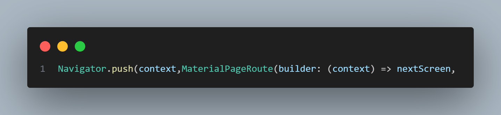
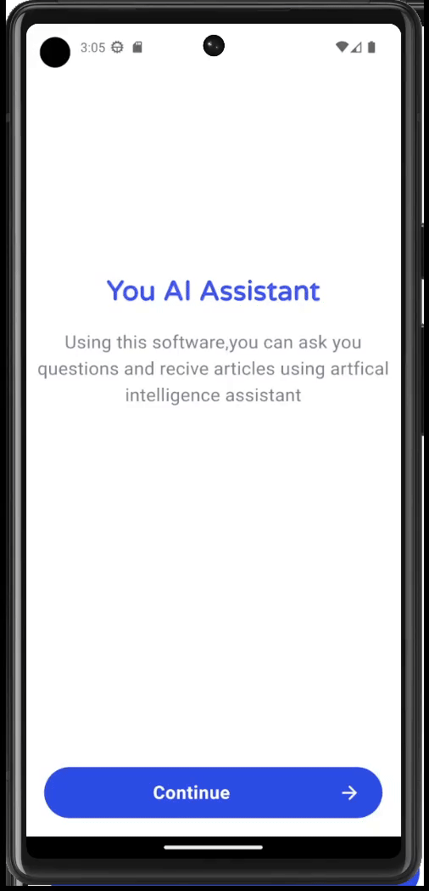

# chatgpt_ui

A new Flutter project that contain three amazing screen for ChatGpt apps.

## Main Widget

### Scaffold
the root for each screen widget

### Container
custmized container 

in example chat container that hold a message :

### Flexible
for control container size

in exaple for holding long message in chat :

### Google Fonts
for additional fonts 

## Main Funcuality

### Navigator
for routing between screen 

## Output

