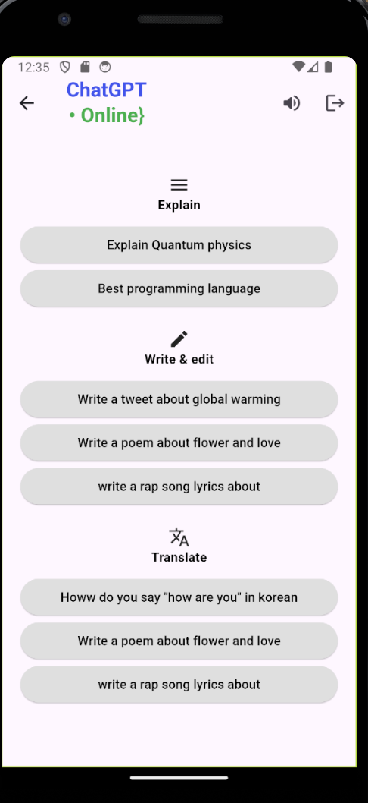
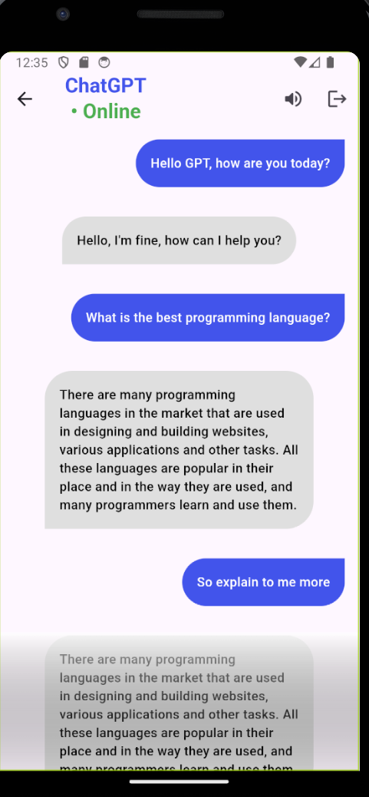

# GPT Chatting UI

An initial version of Chatting app UI created using Flutter for GPT Chatting app.

## Description

This Flutter application is used to chat with GPT AI, it is simple to use and visually appealing. A video showing the UI is uploaded in assets\video

## Work

- Separated long reusable widgets into a separate file for better readability and maintenance
- Stored default GPT messages in a List to access when creating a specific widget
- Used ListView to scroll down for more messages
- Used Padding and Stack widgets to position elements in the right place
- Used Container decoration, color, shape
- Used MainAxisAlignment for easier positioning
- Used ElevatedButton and FloatingActionButton
- Used SizeBox to add spaces between widgets that do not have padding attribute
- Added a shade using color with opacity to fade the last message in the chatting page, it serves as a signal that there is more to read and add an element of art at the same time.

## Screenshots

- Note: a video showing UI is uploaded in assets\video

## Authors
Abdulaziz Alamri

## Version History
**See commits history for more details**

## Acknowledgments
Tuwaiq Academy

