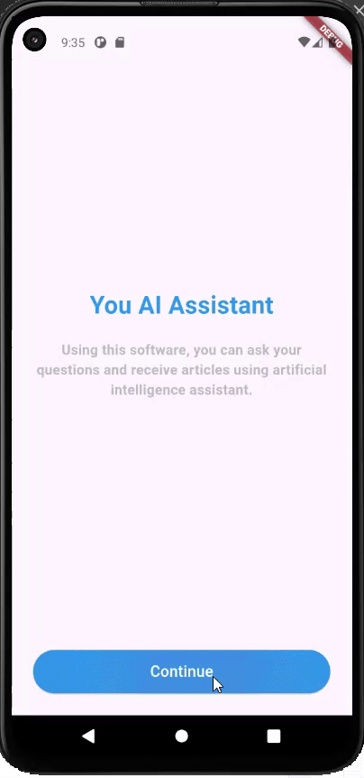

## Assignment-11:
# ChatGPT Flutter App

This Flutter application simulates a basic ChatGPT interface, allowing users to interact with an AI assistant, ask questions, and receive generated responses. The app is structured into multiple screens, each designed with specific functionalities.

## Features

- **Welcome Screen**: An introductory screen that presents the app's purpose and offers navigation to further functionalities.
- **Prompt Selection**: A screen offering predefined prompts that users can select to interact with the AI.
- **Chat Interface**: A screen that mimics a chat environment, allowing users to type messages and receive responses from the AI.

## Screens Overview

### First Screen

- **Description**: Serves as the welcome screen of the app.
- **Components**:
  - App title and description.
  - A "Continue" button that navigates to the Second Screen.

### Second Screen

- **Description**: Displays different categories of prompts that users can select.
- **Components**:
  - Predefined prompts categorized under sections like "Explain".
  - Navigation to the Third Screen on button press.

### Third Screen

- **Description**: A simulated chat interface where users can interact with the AI.
- **Components**:
  - Chat bubbles for displaying user and AI messages.
  - A text field for typing messages.
  - A send button to submit queries.

## Getting Started

## Outupt

   
   