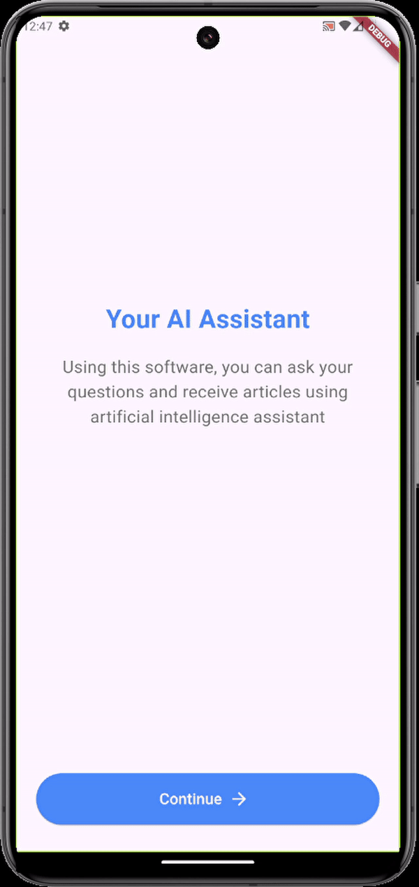

## Assignment-11:
in this project i desigend three pages in flutter useing all learned widgets and navigate between them .

## project Details:

#### - first page(HomeScreen):
 It was created useing column to view the Texts and the ElevatedButton.icon will navgite to next page and SizedBox() to spreate between them

#### - ScreenTwo:

 starting with the Appbar and its attrbiutes 
- leading: using IconButton to navgite to the previos page
- title: using Column to view two text widget and row contining icon and text
- actions: adding two icons

for the body i use column and two custom widgets

- IconLabel : to add icon and text under it 
- CustomButton : styled button beasd on the UI, since it is repeted many times i created a coustom widget. the second button will navgite to next page

#### - ScreenThree:
starting with the same Appbar in ScreenTwo,

for the body i use column and two custom widgets
- SendMassage: a conteinar desgined as the sends massages
- ReceiveMassage: a conteinar desgined as the receive massages

I also used SingleChildScrollView() widget to scroll 

## project output:

## Author:
Rahaf Alghamdi

