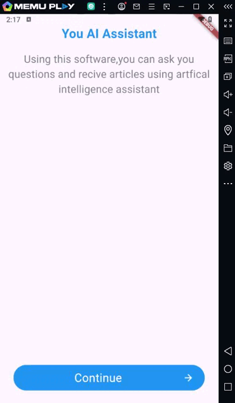

# Flutter ChatGPT Page 

ChatGPT page . ChatGPT help for translate and others , AppBar > back and action , and list tiles with leading icons and subtitles.

**Features:**
<li>Expanded to put the clickable button down
<li>used SingleChildScrollView to let me scroll
<li>used AppBar and impelemnet title \ action 
<li>Customizable colors and icons

