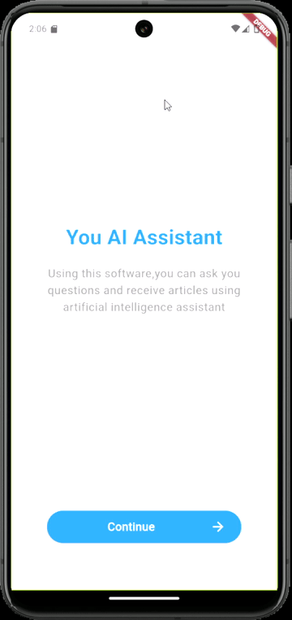

# Assignment 11 : AI Assistant

# 1. Overview 📖
In this assignment, we are supposed to build 3-pages AI Assistant app as follows :
- 1. **First Page** : Welcome Page, where a simple message and continue button are shown.
- 2. **Second Page** : Choices Page, where user can choose a topic to start conversation with AI Assistant.
- 3. **Third Page** : Chat page, where a conversation is taking place between user and AI Assistant.

# 2. Widgets used 🎨
Two Types of widgets were used :
- Basic Widgets
- Custom Widgets

## 2.1 Basic Widgets
- 1. widget one
- 2. widget two
- 3. widget three

Image (1) : Code Snippit of using 1,2,3 widgets.

## 2.2 Custom Widgets
### 2.2.1 Icon with text
This widget represents an icon with a label at the bottom, this widget is used in the **choices page**. See Image (2)

Image (2) : Code Snippit of using IconWithText widget.

# 3. Results ⭐

# 4. Conclusion 🏁
Navigator is a powrful feature that enables user to switch pages and navigate through the app easily.

**By : Yaser Alkhayyat**
