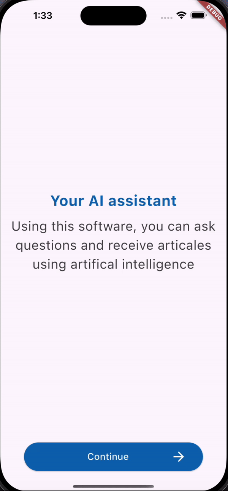

<p align="center">


# ChatGPT simulator
ChatGPT simulator GIF:
<p align="center">


# introduction
A ChatGPT simulator with three screens that can be navigated using arrow keys. The main screen offers an introduction to the app, and you can move to the next screen by clicking `Continue` The following screen contains a Frequently Asked Questions (FAQ) section; selecting a `Best programming language` question will initiate a conversation with ChatGPT. You can use the 'Back' arrow to navigate between these three screens.

## Getting started
 ### Dependencies
You need to install Flutter

### Executing program
1- Fork the Repository.
2- Copy url then go to terminal and write: 
```
git clone ‹url›
```
3- Go to the cloned project using:
```
 cd < PROJECT-NAME> /
 ``` 
4- Create a new branch and checkout this branch: 
```
git checkout -b branch-name
```
5- To create and start dart project 
```
flutter create project_name
cd project_name
code .
```

6- Now to run the program in terminal write:
```
Flutter run
```

